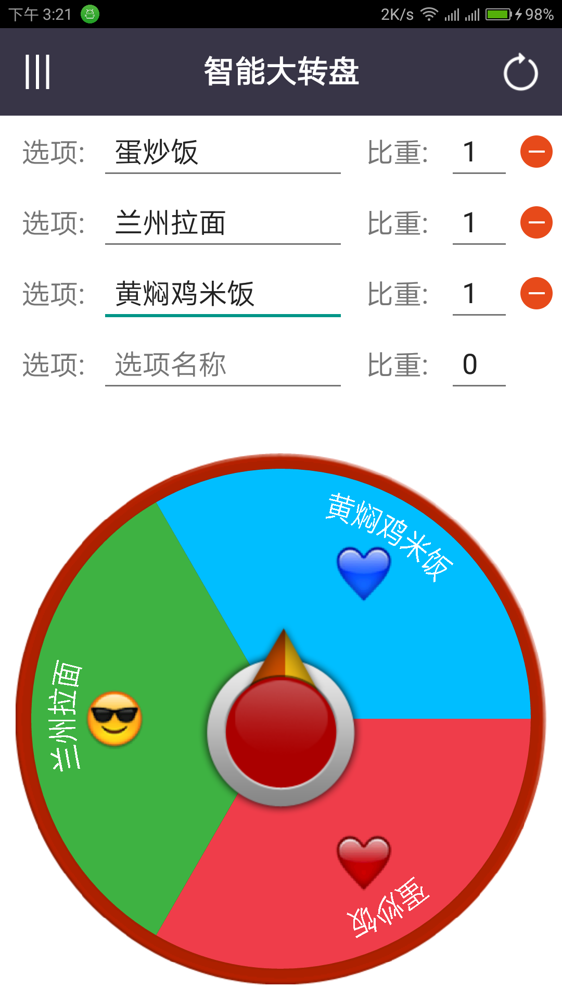
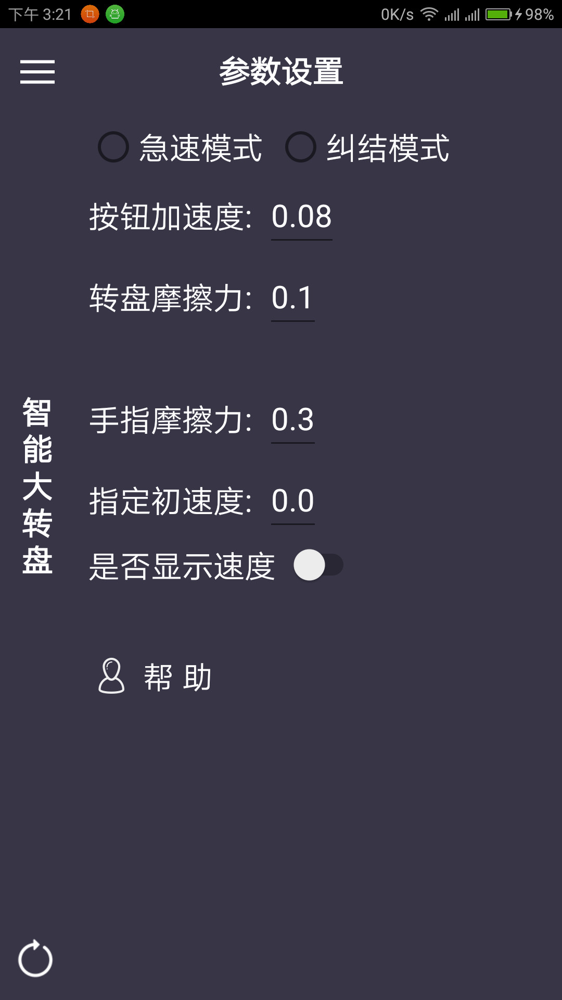
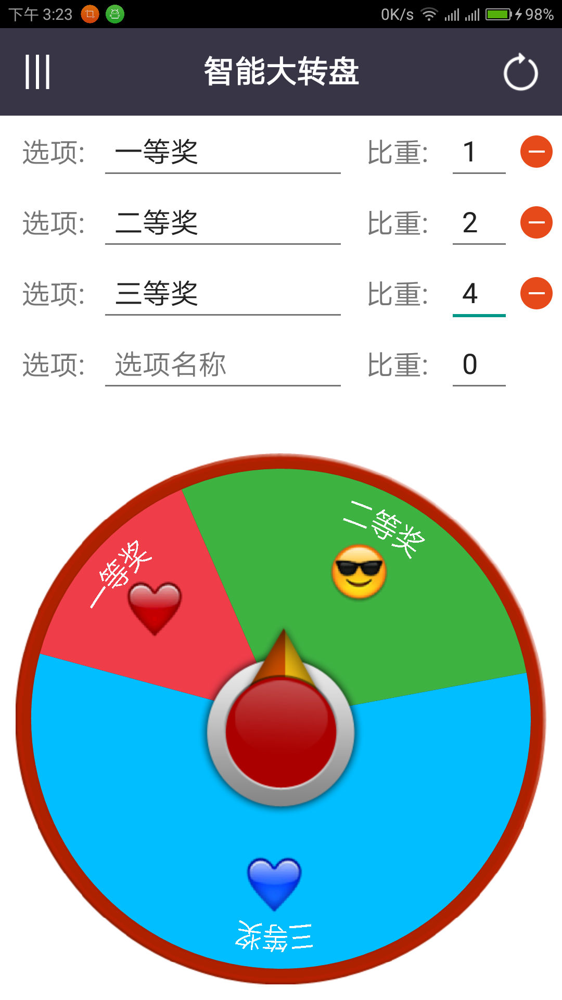

# SmartBigDial
用于选择恐惧症的人，随机选择一个选项，可自定义选项比重等。或用于自定义抽奖活动。基于SurfaceView的自定义View

##应用场景：

1. 每天不知道吃啥饭，把附近可选择的饭菜种类输入到选项中，可以根据好吃程度设置不同的比重。然后让上天帮你决定吃啥吧。
2. 想举办个小型抽奖活动，做个实体转盘好麻烦，直接将智能大转盘安装到手机或平板中，设置好抽奖项和比重即可。
3. 选择恐惧症的同学，随时可以使用此软件帮助自己快速合理地做出决定。

##上线平台：
* 百度手机助手
* 360手机助手
* 91手机助手
* 豌豆荚
* 小米应用
* 魅族应用
* 安智市场

##软件截图：

